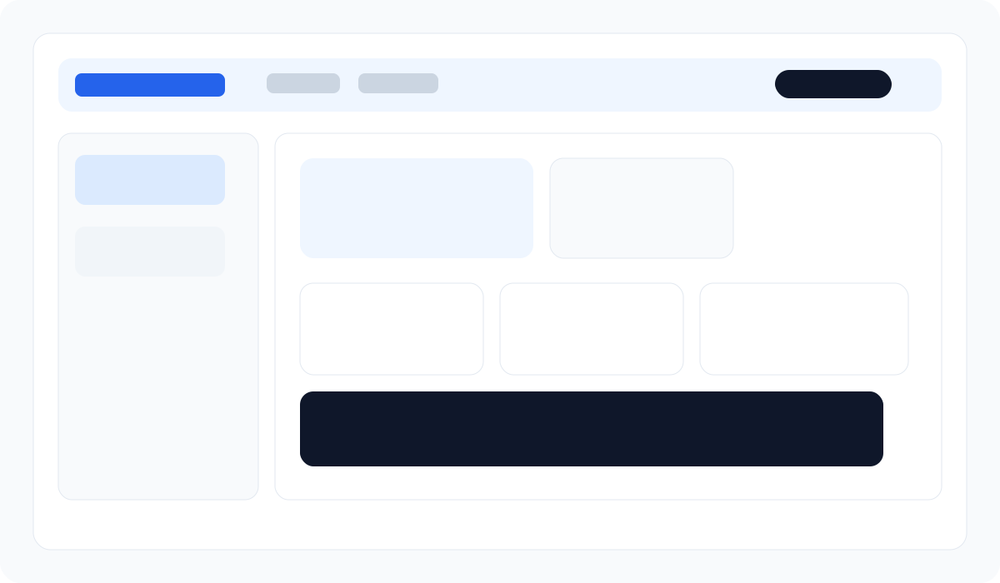

# Placement Eligibility Predictor

## Project Title and Description
Placement Eligibility Predictor is a React + Vite frontend project that presents a student-friendly placement dashboard. It demonstrates core React fundamentals such as reusable components, props, JSX, component-based architecture, and page navigation.

## Features Implemented
- Responsive header and navigation bar
- Sidebar for page switching
- Home page with hero content and reusable information cards
- Dashboard page with stat cards and preparation checklist
- Reusable UI components such as Button, StatCard, InfoCard, HeroSection, Navbar, Sidebar, and Footer

## React Concepts Used
- Introduction to React and Vite project setup
- JSX syntax and component structure
- Functional components
- Props for read-only data flow
- Default and named module exports
- Separate CSS files for styling
- Component reusability and page-based architecture

## Class Components vs Functional Components
- Class components use ES6 class syntax and lifecycle methods, while functional components are simpler JavaScript functions.
- Functional components are easier to read and are widely used in modern React apps with hooks.
- This project uses functional components because they are concise and well suited for building reusable UI blocks.

## Props and main.jsx Explanation
- Props are read-only inputs passed from a parent component to a child component to make UI blocks reusable.
- The main.jsx file is the application entry point. It renders the root component into the DOM using ReactDOM.
- In this project, the main file mounts the App component inside StrictMode.

## Styling Approach Used
- External CSS files were used for each component and page.
- The project follows a simple component-based styling structure so each file keeps its own layout rules.
- The global theme is managed through the main stylesheet.

## Screenshots

## How to Run
1. Install dependencies: npm install
2. Start the development server: npm run dev
3. Open the local Vite URL shown in the terminal

## GitHub Submission Notes
- Create a public GitHub repository for this project.
- Push the completed code with meaningful commits.
- Do not upload node_modules or environment files.
